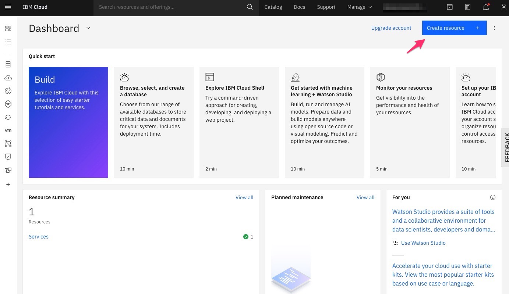
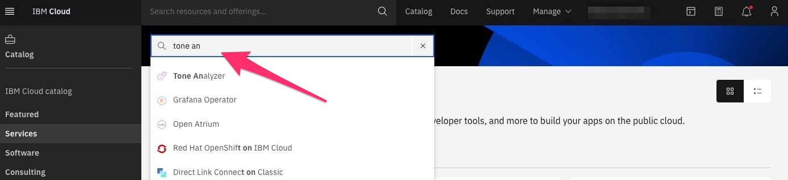
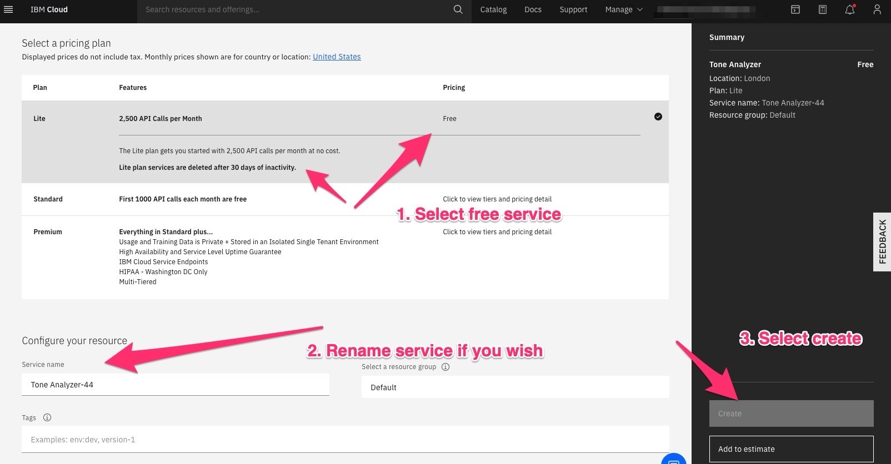
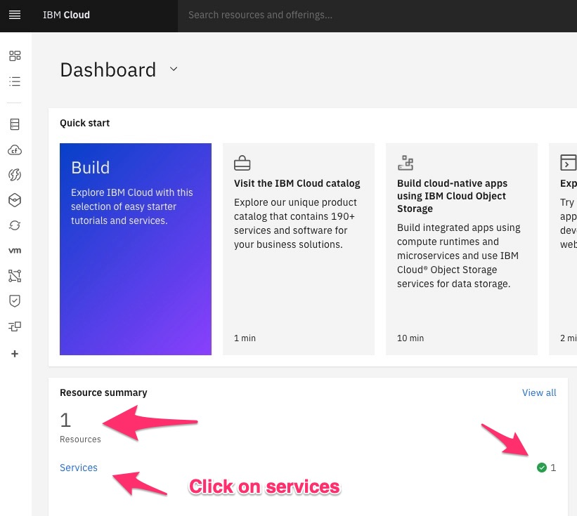
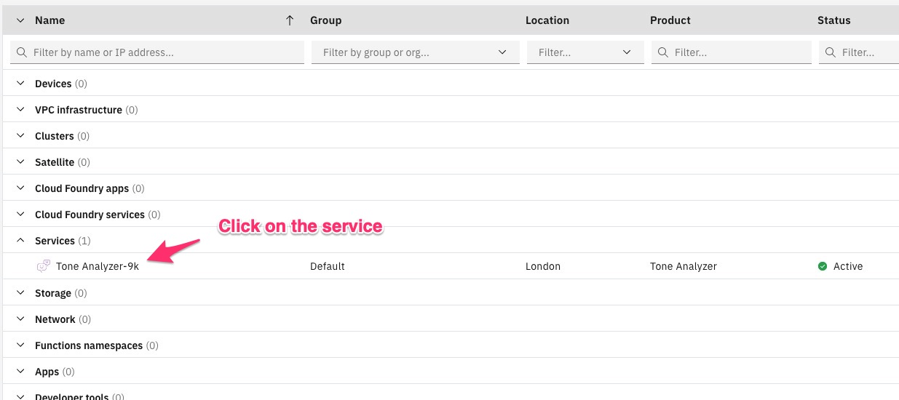
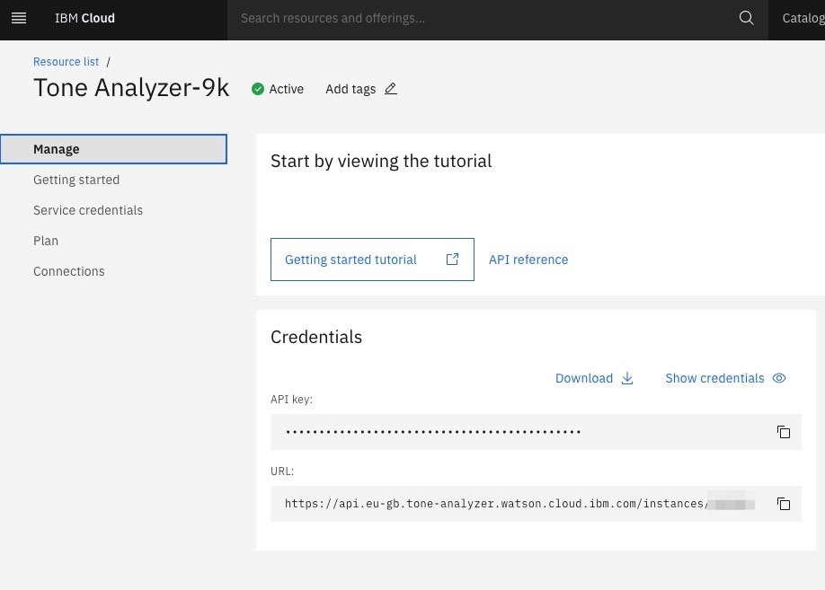

# Tone Analyser services for IBM Watson
This is a basic project to get up and running using IBM Watson's tone analyser.

## The aim of this project
The simple aim is to give users the opportunity to investigate how a tone analyzer service may assist in their business, personal projects or study. 

## What is IBM Watson?
IBM Watson is a service that makes a host of AI tools available to use for your business and you can find out more [here](https://www.ibm.com/uk-en/watson)

## Tone Analyzer
IBM Watson provides a tone analyzer that will receive plain text or JSON and parse the text for sentiment and tone. This service can be integrated in tools such as chatbots, enhancing customer service and more.

## Getting started with IBM Watson Tone analyzer
Before getting started analysing any text you will need to sign up for an IBM cloud account -> Link [here](https://cloud.ibm.com/registration). This is free as is the tone analyzer service within a particular usage of 2,500 calls per month.

### Setting up your tone analyzer service

Once you have landed on your IBM Cloud dashboard you will need to click on 'Create resource' as below:


You will be met with the IBM catalogue of services and simply type in the tone analyzer and it should pop up as below and click on the tone analyzer service:



Once you're in the Tone Analyzer service setup you simply need to setup your service as in the image below:



Once completed head back to the dashboard by clicking the IBM Cloud icon:


When back in your dashboard you should see in the resources a new service added and then click on services:


Once met with the service list click on services and then on the tone analyzer service.



You should now have access to your tone analyzer Api key and endpoint as below:



### Setting up your config file

You will need to create a `config.json` file within the `config` folder at the root of this project with the below structure:

```json
{
  "api_key": "",
  "tone_analyser_url": ""
}
```
Go back to your IBM service and copy and paste both your Api key and url into the respective strings as below:

```json
{
  "api_key": "exAmpl3K3y",
  "tone_analyser_url": "https://api.eu-gb.tone-analyzer.watson.cloud.ibm.com/instances/222222222"
}
```

## Running your first IBM Watson Tone analyzer call

Now configuration has been set up to connect with the tone analyzer we can now send some text.

There are two examples in the `main.py` file that will simply print out to the command line.

by simply un-quoting one of the print statements as below:
```python
from tone_analyser_services.tone_analyser_calls import *

"""
to trial whether your tone analyser is working uncomment the below
"""

print(get_text_tone_from_json_file('text_examples/positive_text.json'))
# print(get_tone_from_text('this is a plain example of posting plain text to get a response'))
```

and running the file you should see a json response as below:
```json
{
  "document_tone": {
    "tones": [
      {
        "score": 0.895001,
        "tone_id": "joy",
        "tone_name": "Joy"
      },
      {
        "score": 0.859164,
        "tone_id": "confident",
        "tone_name": "Confident"
      },
      {
        "score": 0.668742,
        "tone_id": "analytical",
        "tone_name": "Analytical"
      }
    ]
  },
  "sentences_tone": [
    {
      "sentence_id": 0,
      "text": "This is a great message I'm really interested",
      "tones": [
        {
          "score": 0.884476,
          "tone_id": "joy",
          "tone_name": "Joy"
        },
        {
          "score": 0.762356,
          "tone_id": "analytical",
          "tone_name": "Analytical"
        }
      ]
    },
    {
      "sentence_id": 1,
      "text": " This is the best thing that has ever happened!",
      "tones": [
        {
          "score": 0.764403,
          "tone_id": "joy",
          "tone_name": "Joy"
        },
        {
          "score": 0.660207,
          "tone_id": "confident",
          "tone_name": "Confident"
        }
      ]
    }
  ]
}
```

## Services available
At present there are three simple services available:

* `get_tone_from_text(String)` - This service is passed a string, ideally a single string of text and uses the Tone analyzer general end point to respond.

* `get_text_tone_from_json_file(File_Location)` - This will take a local json file and post it to the Tone Analyzer - This endpoint is best used for larger bodies of text. You will be able to see examples in the `text_examples` folder.

### Creating your own text json files

You can use the `get_text_tone_from_json_file(File_Location)` service to post larger amounts of text which can be broken down into separate sentences by using the `\n` character line feed to break a sentence up.

The Tone Analyzer will respond with the overall tone of the document as well as each sentence tone. To see the simply uncomment the `print(get_text_tone_from_json_file('text_examples/positive_text.json'))` in the `main.py` file and run the file for an example.

## Next steps for the project

1. Implement the IBM Watson python sdk for exposure to wider services
2. Create a flask restful endpoint to receive for ease of use
3. Increase mocks for testing responses without connecting to Watson
4. Improve documentation in general for wider usage


## Trouble shooting or raising issues

Please raise issues within github if any features or bugs are found and we will aim to assist.